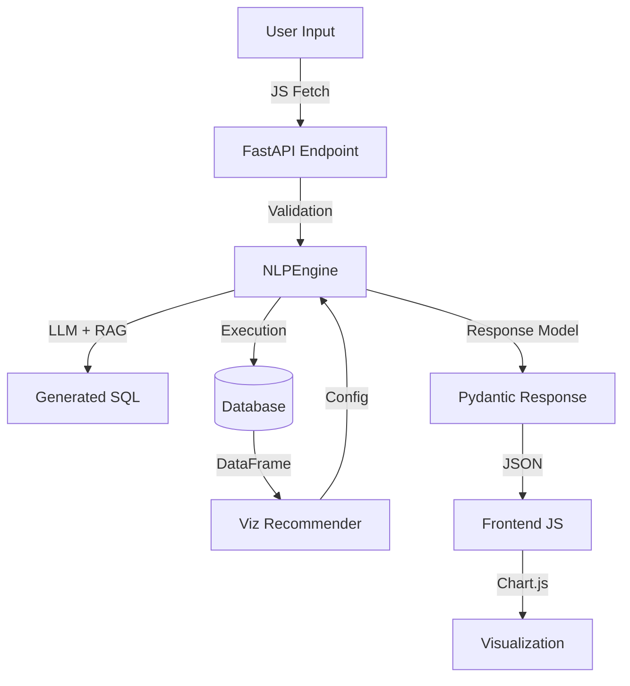

# Data Flow & Debugging Guide

This document details the end-to-end data flow of the NLP-to-SQL system, specifically designed for **debugging purposes**. It traces exactly how a user query travels through the system, where data is transformed, and where potential data loss can occur.

## 1. High-Level Overview



---

## 2. Detailed Data Trace

### Phase 1: Request Initiation (Frontend → API)

**Location**: `web/js/main.js` (`sendMessage()` function)
**Key Payload**:
```json
{
  "question": "ยอดขายแต่ละเดือนของปี 2003",
  "dialect": "mysql",
  "preferred_chart_type": "auto"  // or "bar", "line", etc.
}
```
**Common Issues**:
- `dialect` mismatch with backend DB type.
- `Content-Type` header missing (should be `application/json`).

### Phase 2: API Route & Dependency Injection (API Layer)

**Location**: `api/routes.py` (`query_data` function)
- **Validation**: Incoming JSON is validated against `QueryRequest` schema (`api/schemas.py`).
- **State Injection**: `NLPEngine` instance is injected via `GlobalStateManager` (`api/dependencies.py`).

**Checkpoint**: If `GlobalStateManager.nlp_engine` is None, app startup failed (check `api/main.py`).

### Phase 3: Core Logic Execution (NLPEngine)

**Location**: `core/services/engine.py` (`query_database` method)

#### 3.1 RAG & Context Building
- **Input**: User Question
- **Action**: Retrieve similar SQL examples (`core/data/rag_store.py`).
- **Action**: Retrieve relevant schema (`core/domain/schema_utils.py`, `core/data/schema_rag.py`).
- **Result**: Prompt constructed with question, dialect, schema, and examples.

#### 3.2 LLM Generation
- **Input**: Prompt
- **Action**: Call LLM (Ollama/OpenAI/Gemini) via LangChain.
- **Output**: Raw SQL string.

#### 3.3 SQL Execution & Data Fetching
- **Action**: SQL executed via SQLAlchemy.
- **Result**: Pandas DataFrame (`df`).
- **Transformation**: `df.to_dict(orient='records')` converts to list of dicts.

### Phase 4: Visualization Recommendation (The Logic Trap)

**Location**: `core/viz/viz_recommender.py`

This is a critical logic phase where many underlying issues occur:

1.  **Column Classification**: `detect_series_column()`
    - Detects patterns like year+month to decide if multi-series is needed.
    - **Debugging Check**: Does output `series_col` match expected grouping (e.g., 'year')?

2.  **Chart Selection**: `recommend_chart_with_series()`
    - Decides `chart_type` (Bar/Line/Pie).
    - Selects `x_col` and `y_col`.
    - **Logic Trap**: `x_col` might be selected incorrectly (e.g., selecting 'year' as x instead of 'month').
    - **Swap Logic**: Code specifically checks if `x_col` needs swapping with `series_col`.

3.  **Output**: `VizConfig` dict containing:
    ```python
    {
        "chart_type": "line",
        "x_col": "month",
        "y_col": "amount",
        "series_col": "year",  # Critical for multi-line charts
        "options": ["Bar", "Line", ...]
    }
    ```

### Phase 5: Response Serialization (The Silent Killer)

**Location**: `api/schemas.py` & `api/routes.py`

**CRITICAL DEBUG POINT:**
Even if `engine.py` produces the correct `viz_config`, **Pydantic will silently delete fields that are not defined in the Schema Model.**

1.  **Engine Return**: Returns dict with `series_col`.
2.  **Route Return**: Wraps in `QueryResponse(visualization=viz_config)`.
3.  **Schema Validation**: `VizConfig` model in `api/schemas.py` validates fields.
    - **PITFALL**: If `series_col` is missing in `VizConfig` class, it is stripped from final JSON.

**Checklist**:
- [ ] Field exists in `api/schemas.py`?
- [ ] Field type matches (Optional/List)?

### Phase 6: Frontend Rendering (Browser)

**Location**: `web/js/main.js` (`renderChart` function)

1.  **Receive JSON**: `data.visualization` object.
2.  **Logic Branching**:
    - **Single Series**: Standard arrays for labels/data.
    - **Multi Series**: If `series_col` exists:
        - Group data by `series_col`.
        - Create multiple `dataset` objects (one per group).
        - Align `data` arrays to `x_col` labels (fill missing with null).

**Common Issues**:
- **Browser Cache**: Old JS file loaded (Fix: Hard Refresh `Cmd+Shift+R`).
- **Null Handling**: If data points are missing for some series at certain x-values, chart libraries might break if not handled.

---

## 3. Debugging Checklist

When a feature (like visualization) isn't working:

1.  **Check Backend Logic**:
    - Add `logger.info(f"DEBUG: {viz_config}")` in `core/services/engine.py` right before return.
    - Check terminal output. Is the data correct *before* it leaves the engine?

2.  **Check API Interface**:
    - Use `curl` or Postman to hit the API directly.
    - Does the JSON response contain the fields?
    - **No?** → Check `api/schemas.py` (Pydantic model).

3.  **Check Frontend**:
    - Open Browser Console (`F12`).
    - Inspect Network Response. Is the field present?
    - **Yes, but not rendering?** → Check `web/js/main.js` logic or Browser Cache.

---

## 4. Key File Locations

| Component | File Path | Main Responsibility |
|-----------|-----------|---------------------|
| **Entry Point** | `api/main.py` | App startup, CORS, Static files |
| **API Route** | `api/routes.py` | Endpoint definition, Error handling |
| **Data Model** | `api/schemas.py` | **Response Filtering**, Type Validation |
| **Core Logic** | `core/services/engine.py` | Orchestrator, SQL execution |
| **Viz Logic** | `core/viz/viz_recommender.py` | Chart type & Column selection rules |
| **Frontend** | `web/js/main.js` | UI Logic, Chart rendering |
