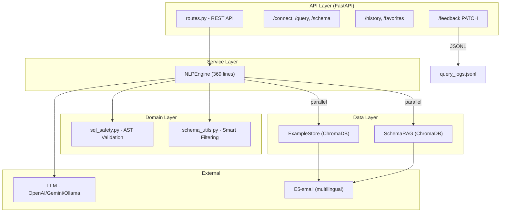

# 🎓 Expert Review: Thai Text-to-SQL System (v2)

**Evaluator:** Professor Kai, Text-to-SQL Researcher  
**Project:** NLP-to-SQL Agent by Chanyut  
**Review Date:** 15 February 2026  
**Branch:** `feature/er_han_and_JSDoc` (HEAD: `fe51821`)

---

## Executive Summary

โปรเจคนี้แสดง **engineering fundamentals ที่ดี** และมี unique research angle ในด้าน Thai Text-to-SQL ที่ field นี้ยังขาดแคลนอย่างมาก ระบบมี architecture ที่ modular, security layer ที่ production-quality, และ Dual-RAG pipeline ที่ innovative

อย่างไรก็ตาม **evaluation methodology ยังเป็น bottleneck สำคัญ** — ต้องแก้ไขเพื่อทั้ง academic credibility และ practical reliability

**Overall Grade: B+ (7.5/10)** — Strong foundation, evaluation is the critical gap

---

## 1. Architecture Assessment

### ✅ Strengths

| Aspect | Implementation | File |
|--------|---------------|------|
| **Modular DDD** | Clean separation `api/`, `core/services/`, `core/domain/`, `core/data/`, `core/viz/` | Project-wide |
| **Multi-LLM Support** | OpenAI, Google Gemini (`gemini-2.0-flash-exp`), Ollama (`qwen2.5-coder:7b`) | [config.py](file:///Users/chanyut/Documents/nlp_sql_project/core/config.py) |
| **Async Architecture** | `asyncio.gather` for parallel Example RAG + Schema RAG retrieval | [engine.py](file:///Users/chanyut/Documents/nlp_sql_project/core/services/engine.py#L246-L249) |
| **Centralized Config** | All settings in one `Settings` class with env var support | [config.py](file:///Users/chanyut/Documents/nlp_sql_project/core/config.py) |
| **SQL Safety (AST-based)** | `sqlglot` parsing, read-only enforcement, LIMIT injection, table allowlist | [sql_safety.py](file:///Users/chanyut/Documents/nlp_sql_project/core/domain/sql_safety.py) |
| **Dialect Transpilation** | MySQL ↔ SQLite ↔ PostgreSQL via `sqlglot` with compatibility validation | [dialect_transpiler.py](file:///Users/chanyut/Documents/nlp_sql_project/core/utils/dialect_transpiler.py) |
| **FK-aware Schema** | Schema extraction includes PK/FK annotations + consolidated FK section | [schema_utils.py](file:///Users/chanyut/Documents/nlp_sql_project/core/domain/schema_utils.py#L14-L72) |

### Architecture Diagram



### ⚠️ Architecture Issues

| Issue | Impact | Location |
|-------|--------|----------|
| **God Class `NLPEngine`** | 369 lines — LLM init, prompt, RAG, execution, retry, viz all in one class | [engine.py](file:///Users/chanyut/Documents/nlp_sql_project/core/services/engine.py) |
| **No Dependency Injection** | `__init__()` creates all deps directly → hard to unit test | [engine.py#L28-L36](file:///Users/chanyut/Documents/nlp_sql_project/core/services/engine.py#L28-L36) |
| **Broken import in smart_filter** | `from core.schema_rag import expand_tables_with_relationships` — should be `core.data.schema_rag` | [schema_utils.py#L297](file:///Users/chanyut/Documents/nlp_sql_project/core/domain/schema_utils.py#L297) |
| **No Connection Pooling** | New `Engine` created per connection | [routes.py](file:///Users/chanyut/Documents/nlp_sql_project/api/routes.py) |
| **Logging inconsistency** | `routes.py` uses own LOG_FILE constants instead of `settings.LOG_FILE_*` | [routes.py#L23-L24](file:///Users/chanyut/Documents/nlp_sql_project/api/routes.py#L23-L24) |

---

## 2. Thai NLP Capabilities — The Core Differentiator

### ✅ What Works Well

1. **Thai-English Schema Mapping** — 74 entries covering 22+ Thai keywords mapped to schema concepts
   - ครอบคลุม: ยอดขาย, ลูกค้า, สินค้า, ออเดอร์, พนักงาน, ชำระเงิน, สาขา, เวลา, aggregation terms
   - [schema_rag.py#L21-L74](file:///Users/chanyut/Documents/nlp_sql_project/core/data/schema_rag.py#L21-L74)

2. **Multilingual Embeddings** — `intfloat/multilingual-e5-small` with proper E5 prefixes
   - ✅ `query:` prefix for search, `passage:` prefix for indexing
   - Best practice handling in both [rag_store.py#L108](file:///Users/chanyut/Documents/nlp_sql_project/core/data/rag_store.py#L108) and [schema_rag.py#L198](file:///Users/chanyut/Documents/nlp_sql_project/core/data/schema_rag.py#L198)

3. **Rich Thai Prompt Hints** — 5 categories of Thai keyword → SQL patterns:
   - Aggregation (ยอดขาย → SUM, จำนวน → COUNT, etc.)
   - Ratio & Rate (อัตราส่วน, สัดส่วน, เปอร์เซ็นต์, เติบโต/growth)
   - Time Grouping (รายเดือน, รายปี, รายไตรมาส, ล่าสุด)
   - Negation & NULL (ไม่เคย → LEFT JOIN...IS NULL, ไม่มี → IS NULL)
   - Advanced (แต่ละ → GROUP BY, ที่มี...มากกว่า → HAVING)
   - [engine.py#L103-L133](file:///Users/chanyut/Documents/nlp_sql_project/core/services/engine.py#L103-L133)

4. **Thai Visualization Keywords** — Chart detection from Thai terms ("วงกลม" → pie, "แท่ง" → bar)

### ⚠️ Gaps in Thai Language Handling

| Gap | Severity | Detail |
|-----|----------|--------|
| **No Thai Tokenization** | 🔴 High | ไม่มี word segmentation — rely on embedding model อย่างเดียว ควรใช้ PyThaiNLP |
| **Limited Paraphrasing** | 🟡 Medium | "ขายได้เท่าไหร่" vs "ยอดขายเป็นเท่าไร" vs "ขายไปกี่บาท" — ยังไม่ cover ครบ |
| **Mixed-language Queries** | 🟡 Medium | "ยอดขาย product_line" — ไม่มี explicit handling Thai+English mixing |
| **Thai Numerals** | 🟢 Low | ไม่มี conversion ๑๒๓ → 123 |
| **Schema covers 1 domain** | 🟡 Medium | Thai mappings เน้นเฉพาะ sales/retail — ยังขาด medical, education, etc. |

### 🔬 Research Opportunity

> [!IMPORTANT]
> **Thai Text-to-SQL is severely under-researched.** ไม่มี benchmark เทียบเท่า Spider/BIRD สำหรับภาษาไทย โปรเจคนี้มีศักยภาพที่จะสร้าง **Thai Text-to-SQL benchmark แรก** — ซึ่งเป็น contribution ที่ publishable มาก

---

## 3. Dual-RAG System Analysis

### Example RAG ([rag_store.py](file:///Users/chanyut/Documents/nlp_sql_project/core/data/rag_store.py))

| Metric | Current | Recommendation |
|--------|---------|----------------|
| **Example Count** | **54** (25 generic + 29 classicmodels) | ≥200 for robust few-shot |
| **Distance Threshold** | 15.0 | Should empirically tune; seems very permissive |
| **Top-K** | 3 | Good; experiment with k=1,3,5,7 |
| **Dialect Awareness** | ✅ Filter + auto-transpile | Excellent feature |
| **Fallback Logic** | ✅ Falls back to all dialects if filtered results < top_k | Smart |
| **E5 Prefixes** | ✅ `query:` / `passage:` | Correctly implemented |

### Schema RAG ([schema_rag.py](file:///Users/chanyut/Documents/nlp_sql_project/core/data/schema_rag.py))

| Feature | Assessment |
|---------|-----------|
| **3-Tier Filtering** (keyword → semantic → LLM) | ◉ Excellent fallback chain |
| **Thai-English Mapping** | ◉ 22+ keywords, pragmatic approach |
| **FK Relationship Expansion** | ◉ Auto-includes related tables for JOINs |
| **Schema Caching** | ◉ Skips re-indexing if tables match |
| **Only for Ollama** | ⚠️ Cloud LLMs skip Schema RAG — could benefit too for large schemas |

### Missing RAG Features

- **Negative Examples** — ตัวอย่าง SQL ที่ผิดที่ LLM ไม่ควรสร้าง
- **Query Decomposition** — แยกคำถามซับซ้อนเป็น sub-queries ก่อน RAG retrieval
- **Adaptive Threshold** — threshold ควรปรับตาม query complexity
- **Deduplication** — ตัวอย่าง "ยอดขายรวมทั้งหมด" มี 2 versions (line 6 + line 181) → อาจ bias retrieval

---

## 4. Evaluation — ⚠️ Critical Gap

> [!CAUTION]
> **นี่คือส่วนที่สำคัญที่สุดที่ต้องแก้ไข.** ถ้าไม่มี rigorous evaluation, ทุก architectural decisions จะอิงจาก intuition ไม่ใช่ evidence

### Current State

| Component | Status | Issue |
|-----------|--------|-------|
| [run_eval.py](file:///Users/chanyut/Documents/nlp_sql_project/eval/run_eval.py) | ⚠️ Partial | Only validates **golden SQL syntax** — ไม่ได้ test LLM generation เลย |
| [build_dataset.py](file:///Users/chanyut/Documents/nlp_sql_project/eval/build_dataset.py) | ✅ Works | Builds dataset from query logs with feedback |
| [analyze_feedback.py](file:///Users/chanyut/Documents/nlp_sql_project/analyze_feedback.py) | ✅ New | Analyzes SFT/DPO readiness from feedback data — ดีมาก |
| `thai_sql_examples.json` | ⚠️ Dual-use | ใช้ทั้ง RAG training **และ** evaluation → **Data Leakage!** |
| End-to-end eval | ❌ Missing | ไม่สามารถ test: Question → NLPEngine → SQL → Execute → Compare |
| Standard metrics | ❌ Missing | ไม่มี Exact Match, Execution Accuracy, VES |

### 🔴 Data Leakage Problem

```
⚠️ CURRENT (PROBLEMATIC):
thai_sql_examples.json ← ใช้ทั้ง RAG training + evaluation

✅ SHOULD BE:
thai_sql_examples.json     ← RAG examples (training)  
eval/golden_test_set.json  ← Evaluation ONLY (held-out, never in RAG)
```

### Standard Metrics to Implement

| Metric | Definition | Target (Thai) |
|--------|-----------|------|
| **Exact Match (EM)** | SQL matches gold after normalization | >40% |
| **Execution Accuracy (EX)** | Same results as gold SQL | >70% |
| **Valid SQL Rate (VS)** | Parses without syntax errors | >90% |
| **Test Suite Accuracy (TS)** | Passes multiple test DBs (BIRD-style) | Advanced |

### Proposed Error Taxonomy

```
Error Categories:
├── Schema Errors
│   ├── Wrong table selected
│   ├── Wrong column selected  
│   └── Missing/wrong JOIN condition
├── Thai Understanding Errors
│   ├── Misinterpreted Thai keyword
│   ├── Wrong aggregation function
│   └── Missed filter condition
├── SQL Syntax Errors
│   ├── Dialect mismatch (MySQL vs SQLite)
│   └── Invalid function usage
└── Logic Errors
    ├── Wrong GROUP BY
    ├── Missing WHERE clause
    └── Incorrect ORDER BY direction
```

---

## 5. Dataset Quality Analysis

### `thai_sql_examples.json` — 54 Examples

| SQL Pattern | Count | Coverage Assessment |
|------------|-------|-----|
| Simple SELECT | ~5 | ✅ OK |
| Aggregation (SUM, COUNT, AVG) | ~15 | ✅ Good |
| GROUP BY | ~10 | ✅ Good |
| Ranking (ORDER BY + LIMIT) | ~8 | ✅ Good |
| 2-Table JOIN | ~8 | ✅ Good |
| **Multi-hop JOIN (3+ tables)** | **4** | ⚠️ Need more |
| **Cross-name FK** | **1** | ⚠️ Need more (salesRepEmployeeNumber → employeeNumber) |
| **Subqueries** | **0** | ❌ Missing |
| **Window Functions** | **0** | ❌ Missing |
| **UNION / INTERSECT** | **0** | ❌ Missing |
| **CASE WHEN** | **0** | ❌ Missing (was ~2 in earlier review, now 0) |
| **NOT EXISTS / NOT IN** | **0** | ❌ Missing (despite prompt hints for "ไม่เคย") |
| **Date Range (BETWEEN)** | **0** | ❌ Missing |
| Scatter/Complex Viz | 2 | 🆕 New additions |

### Schema Coverage

| Schema | Examples | Status |
|--------|----------|--------|
| `receipt` (local_database.db) | 25 | Simple schema, good coverage |
| `classicmodels` (8 tables) | 29 | Multi-table, JOINs, good but needs more complexity |
| Other schemas | 0 | ❌ Not tested |

### Recommendations for Dataset Expansion

1. **Target: 200+ examples** split → 150 training (RAG) + 50 held-out (eval)
2. **Add missing SQL patterns**: Subqueries, Window Functions, CASE WHEN, UNION, NOT EXISTS, BETWEEN
3. **Add complexity tiers**: Easy (30%), Medium (40%), Hard (20%), Extra Hard (10%)
4. **Add Thai paraphrase variants**: 3-5 Thai phrasings for each SQL intent
5. **Add "impossible" queries**: คำถามที่ตอบไม่ได้จาก schema (test hallucination resistance)

---

## 6. Prompt Engineering Assessment

### Current Prompt — [engine.py#L84-L150](file:///Users/chanyut/Documents/nlp_sql_project/core/services/engine.py#L84-L150)

| Aspect | Status | Notes |
|--------|--------|-------|
| Role definition | ✅ | "expert SQL analyst specialized in Thai" |
| Explicit rules (6 rules) | ✅ | Read-only, LIMIT, single statement, no %, no markdown |
| Dialect-specific cheat sheet | ✅ | Date + String functions |
| **Thai keyword hints** | ✅✅ | **5 categories** — Aggregation, Ratio, Time, Negation, Advanced — **very comprehensive** |
| Step-by-step reasoning | ✅ | 4-step process with FK emphasis |
| Dynamic RAG examples | ✅ | Injected via `{dynamic_examples}` |
| Dynamic schema | ✅ | FK-annotated schema via `{schema}` |

### Areas for Improvement

| Area | Current | Recommended |
|------|---------|-------------|
| **Chain-of-Thought** | Implicit "Think step by step" | Explicit structured output: `-- Tables: ...\n-- JOINs: ...\n-- SQL:` |
| **Schema Linking** | "Check FK annotations" | Add: "First, list ALL tables and columns you will use before writing SQL" |
| **Common Mistakes** | Not mentioned | Add: "⚠️ Do NOT use YEAR() in SQLite — use strftime('%Y', col)" |
| **No-answer handling** | Not addressed | Add: "If the question cannot be answered from the schema, respond with: CANNOT_ANSWER" |

---

## 7. Self-Correction Loop

The retry loop in [engine.py#L279-L367](file:///Users/chanyut/Documents/nlp_sql_project/core/services/engine.py#L279-L367) is **above average**:

| Feature | Status |
|---------|--------|
| Distinguishes table vs column errors | ✅ |
| Specific correction prompts per error type | ✅ |
| Full schema + FK info in correction prompt | ✅ |
| Configurable retries (default: 2) | ✅ |
| Uses pretty-printing after validation | ✅ |

### Improvements Needed

- **Track correction success rate** — ควร log ว่า retry สำเร็จกี่ % เพื่อ measure ประสิทธิภาพ
- **Temperature adjustment** — Consider 0.0 → 0.1 → 0.3 on each retry to explore alternatives
- **Error-specific examples** — ใส่ตัวอย่าง correction ที่เคยสำเร็จลงใน retry prompt

---

## 8. Security Assessment

| Feature | Implementation | Grade |
|---------|---------------|-------|
| AST-based SQL validation | `sqlglot.parse_one()` + walk for disallowed nodes | **A** |
| Read-only enforcement | Whitelist: SELECT, WITH...SELECT, UNION, INTERSECT, EXCEPT | **A** |
| Multi-statement blocking | Explicit `len(statements) != 1` check | **A** |
| LIMIT injection + clamping | Auto-inject + clamp to max (500) | **A** |
| Table allowlist | Optional restriction via SafeSQL | **A** |
| XSS sanitization (frontend) | DOMPurify + separate commit | **A-** |
| **API Authentication** | ❌ Not implemented | **F** |
| **Credential handling** | Client sends DB credentials in plaintext | **D** |
| **Rate Limiting** | ❌ Not implemented | **D** |

---

## 9. Feedback & Fine-tuning Pipeline

### 🆕 New: [analyze_feedback.py](file:///Users/chanyut/Documents/nlp_sql_project/analyze_feedback.py)

ดีมากที่มี script นี้! มันวิเคราะห์ readiness สำหรับ:

| Training Method | Requirements | Current Status |
|----------------|-------------|----------------|
| **SFT** (Supervised Fine-Tuning) | 100-200 positive examples | Unknown (depends on feedback count) |
| **DPO** (Direct Preference Optimization) | 50-100 preference pairs | Unknown |
| **RAG Enhancement** | Positive examples → RAG store | ✅ Already implemented via `build_dataset.py` |

> [!TIP]
> **Action Item:** Run `python analyze_feedback.py` to get exact numbers and determine if you're ready for SFT/DPO

### Feedback API — [routes.py#L176-L189](file:///Users/chanyut/Documents/nlp_sql_project/api/routes.py#L176-L189)

- ✅ PATCH `/history/{log_id}/feedback` endpoint
- ✅ Supports `feedback` + `feedback_text` fields
- ✅ ข้อมูล feedback เก็บใน `query_logs.jsonl`

---

## 10. Testing Assessment

### Current Test Coverage

| Test File | Coverage | Status |
|-----------|----------|--------|
| `tests/unit/test_sql_safety.py` | SQL validation logic | ✅ |
| `tests/unit/test_config.py` | Configuration loading | ✅ |
| `tests/unit/test_dialect_transpiler.py` | Dialect conversion | ✅ |
| `test_schema_tier.py` | Schema tiered filtering | ⚠️ Not in `tests/` dir |
| `test_viz_ai.py` | Visualization AI recommendations | ⚠️ Not in `tests/` dir |
| **Integration tests** | End-to-end NLPEngine | ❌ Missing |
| **RAG retrieval tests** | Example retrieval accuracy | ❌ Missing |
| **API tests** | FastAPI endpoints | ❌ Missing |

### CI/CD

- ✅ GitHub Actions workflow (`d447da7`)
- ⚠️ Previous Ruff linter errors (E402, F841, F541) — fixed in separate conversation

---

## 11. Documentation Assessment

ส่วน documentation ทำได้ดีมาก — มี **15 docs** ใน `/docs/`:

| Document | Size | Content |
|----------|------|---------|
| `PRODUCT_SPEC.md` | 23KB | Comprehensive product specification |
| `TUNING_GUIDE.md` | 28KB | LLM tuning techniques, LoRA/QLoRA, evaluation metrics |
| `DEVELOPMENT_PLAN.md` | 51KB | Detailed project roadmap and task breakdown |
| `Data_Flow.md` | 6KB | System data flow diagrams |
| `RAG_AUTO_TRANSPILATION.md` | 10KB | RAG transpilation documentation |
| `RISK_ANALYSIS.md` | 11KB | Risk assessment |
| `PERFORMANCE_FAQ.md` | 6KB | Performance Q&A |
| `LGESQL_INTEGRATION.md` | 11KB | Future LGESQL integration plan |
| `PROGRESS_REPORT.md` | 17KB | Progress tracking |

> [!NOTE]
> Documentation coverage is **excellent** for a student project — ดีกว่าหลาย production projects

---

## 12. Comparison with State-of-the-Art

| Feature | This Project | DIN-SQL (2023) | DAIL-SQL (2023) | MAC-SQL (2024) |
|---------|-------------|----------------|-----------------|----------------|
| **Architecture** | Single LLM + Dual RAG | Decompose + Classify + Generate | Prompt Selection + Few-shot | Multi-Agent |
| **Schema Linking** | RAG + Thai Keywords + LLM Fallback | Dedicated classifier | Example-driven | Agent-driven |
| **Self-Correction** | ✅ 2-retry with error-specific prompts | ✅ Self-correction | ❌ None | ✅ Multi-turn |
| **Few-shot** | Dynamic RAG (E5 multilingual) | Static selection | Dynamic (DAIL) | Dynamic |
| **Thai Support** | ✅ **Native** | ❌ English only | ❌ English only | ❌ English only |
| **FK Awareness** | ✅ AST-extracted FKs in prompts | Partial | No | Schema-driven |
| **Evaluation** | ⚠️ Golden SQL only | Spider benchmark | Spider + BIRD | Spider + BIRD |
| **EX Accuracy** | ❓ Unknown | 85.3% (Spider) | 86.6% (Spider) | 59.4% (BIRD) |

---

## 13. Research Publication Potential

### Target Conferences

| Conference | Relevance | Submission Angle |
|-----------|----------|-----------------|
| **NCCL** (Thai NLP) | 🔴 Very High | "ระบบแปลงภาษาไทยเป็น SQL: Dual-RAG Architecture with Thai Schema Linking" |
| **NAACL/ACL Workshop** | 🟡 High | "Thai Text-to-SQL: A Benchmark and RAG-based Approach" |
| **IEEE IALP** | 🟡 High | "Multilingual Text-to-SQL with Dual-RAG and Error-Specific Self-Correction" |

### What's Needed for Publication

| Requirement | Status |
|------------|--------|
| ✅ Novel contribution (Thai Text-to-SQL + Dual-RAG) | **Have it** |
| ❌ Standardized test set (held-out, 50+ examples) | **Need it** |
| ❌ Baseline comparisons (≥2 approaches: direct prompting, single-RAG) | **Need it** |
| ❌ Error analysis with Thai-specific linguistic insights | **Need it** |
| ✅ System description + architecture | **Have it** |
| ❌ Execution Accuracy metrics | **Need it** |

---

## 14. Paper Collection Assessment

ดีมากที่มี `paper/` directory พร้อม reference papers ที่เกี่ยวข้อง:

| Paper | Relevance |
|-------|-----------|
| A Survey on Text-to-SQL Parsing | Foundation knowledge |
| RAGSQL | **Direct reference** — context retrieval for Text-to-SQL prompts |
| Text-to-SQL Empowered by LLMs | Benchmark evaluation methodology |
| CodeS | Code generation for SQL |
| LGESQL | Graph-enhanced schema linking |
| MaskSQL | Privacy-preserving Text-to-SQL |
| KNOWLEDGE DISTILLATION | Model compression techniques |

> [!TIP]
> **RAGSQL paper** เป็น direct related work — ควรอ่านและ cite เป็น baseline comparison

---

## 15. Actionable Recommendations (Priority Order)

### 🔴 P0: Critical (ทำก่อน)

| # | Action | Effort | Impact |
|---|--------|--------|--------|
| 1 | **Fix `run_eval.py`** — decouple from Streamlit, call `NLPEngine.query_database()` directly | 2-3 hrs | End-to-end evaluation possible |
| 2 | **Separate train/test data** — create `eval/golden_test_set.json` (50+ held-out examples) | 3-4 hrs | Eliminate data leakage |
| 3 | **Implement EX metric** — compare generated SQL results vs gold SQL results | 2-3 hrs | Academic credibility |
| 4 | **Fix broken import** — `schema_utils.py#L297` → change to `core.data.schema_rag` | 5 min | Runtime bug fix |

### 🟡 P1: Important (ทำต่อ)

| # | Action | Effort | Impact |
|---|--------|--------|--------|
| 5 | **Expand dataset to 200+ examples** — add subqueries, window functions, CASE WHEN, NOT EXISTS | 4-6 hrs | Better RAG coverage |
| 6 | **Implement error taxonomy** — categorize every evaluation failure | 2-3 hrs | Research insight |
| 7 | **Add baseline comparisons** — test direct prompting (no RAG) vs single-RAG vs Dual-RAG | 3-4 hrs | Publication requirement |
| 8 | **Refactor `NLPEngine`** — extract to `PromptBuilder`, `SQLExecutor`, `RetryManager` | 4-6 hrs | Testability |

### 🟢 P2: Nice to Have

| # | Action | Effort | Impact |
|---|--------|--------|--------|
| 9 | Add Thai tokenization (PyThaiNLP) | 2-3 hrs | Better schema linking |
| 10 | Multi-database evaluation | 4-6 hrs | Generalizability |
| 11 | Cross-lingual experiments (Thai vs English) | 3-4 hrs | Academic insight |
| 12 | LoRA fine-tuning pilot | 8-12 hrs | Potential accuracy boost |

---

## 16. Score Summary

| Dimension | Score | Key Notes |
|-----------|-------|-----------|
| **Architecture** | 8/10 | Clean DDD, async, needs DI refactor |
| **Thai NLP** | 7.5/10 | Comprehensive keyword hints, needs tokenization |
| **RAG System** | 8/10 | Dual-RAG innovative, E5 properly configured |
| **Evaluation** | 3/10 | ⚠️ **Critical gap** — only golden SQL validation |
| **Dataset** | 5/10 | 54 examples, missing advanced patterns |
| **Prompt Engineering** | 8/10 | Excellent Thai hints, needs structured CoT |
| **Self-Correction** | 7.5/10 | Error-specific retry, needs success tracking |
| **Security** | 8.5/10 | Production-quality SQL safety, no auth |
| **Testing** | 4/10 | Unit tests only, no integration/API tests |
| **Documentation** | 9/10 | Extensive — 15 docs covering every aspect |
| **Research Potential** | 7.5/10 | High potential, needs eval rigor |
| **Overall** | **7.5/10** | **Strong project, evaluation is the bottleneck** |

---

> [!IMPORTANT]
> **เส้นทางที่เร็วที่สุดสู่ผลงานที่ publishable:**
> 1. Fix evaluation → 2. Expand dataset → 3. Run experiments (direct vs single-RAG vs dual-RAG) → 4. Write error analysis  
> Architecture ดีพอแล้ว — สิ่งที่ขาดคือ **การพิสูจน์ด้วยตัวเลข**

---

*Reviewed by Professor Kai | 15 February 2026*
